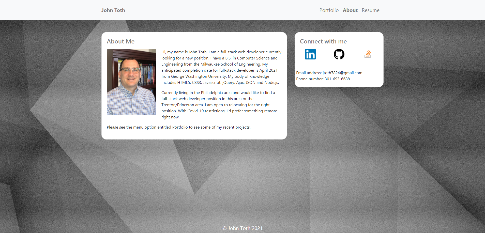
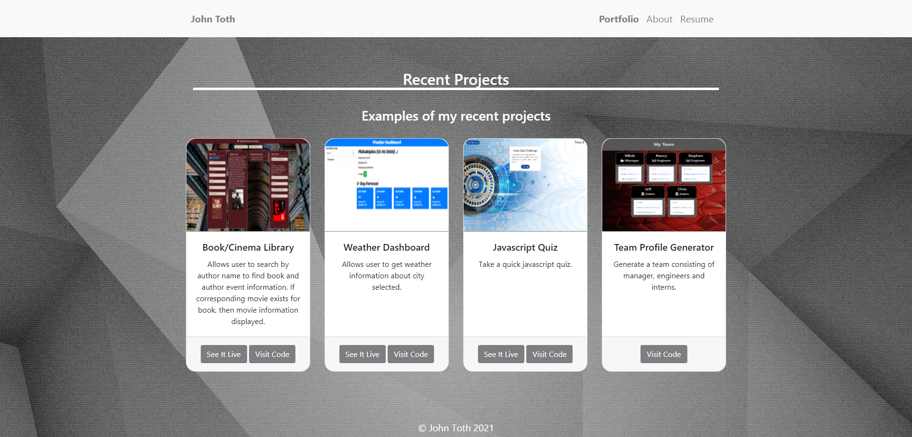

# portfolio

## Description

This Portfolio contains contact information for me.   It also displays my body of knowledge and information about what I'm looking for.    There is also a link to my recent projects.    For each of these projects there is a screenshot of the application along with buttons to try out the application or to go directly to the GitHub repository for the code.

## Screenshots
 
The following is a screenshot of the About me page of the portfolio application.

  

The following is a screenshot of the Projects page of the portfolio application.

  

## Setup/Installation Requirements

Direct link to repository:  https://github.com/jtoth7824/portfolio

Direct link to Portfolio webpage:  https://jtoth7824.github.io/portfolio/